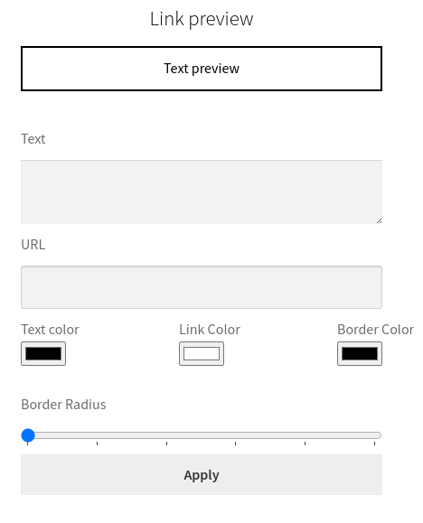
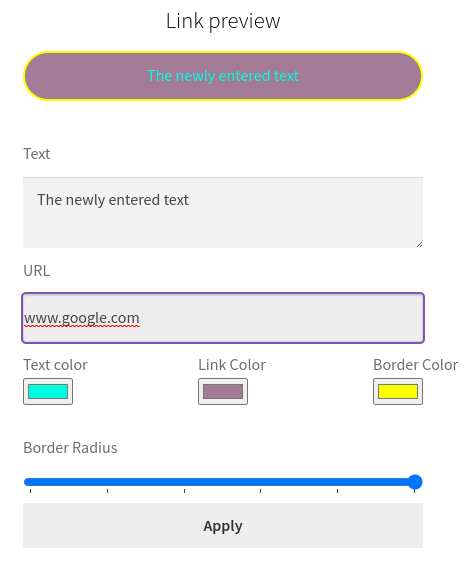
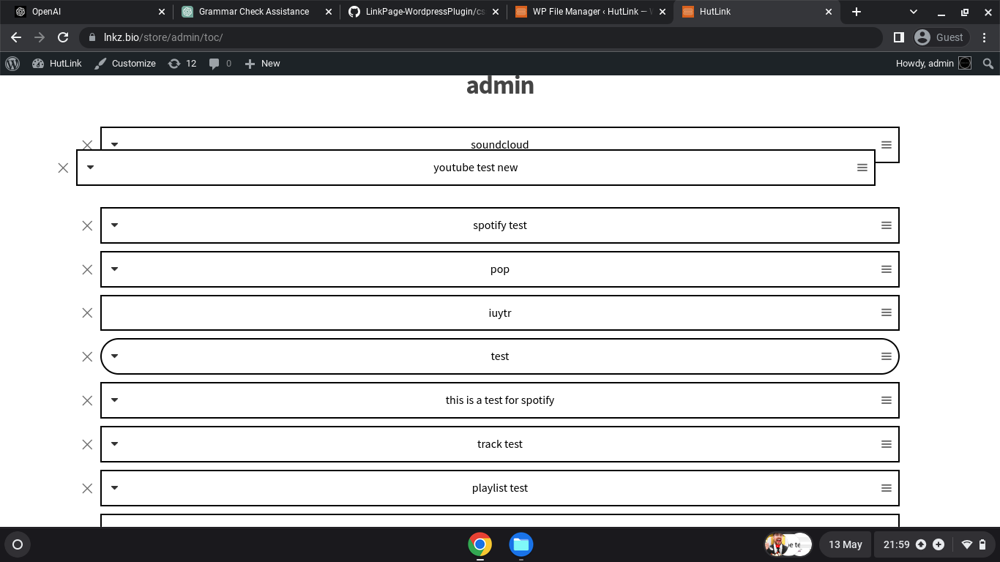

# LinkPage-WordpressPlugin
This is a WordPress plugin that can be installed on your site. It works exactly the same as Linktr.ee but with a few added features.

In a nutshell: Since I have built this code with WooCommerce in mind, the plugin allows all users to have their own personal shop where they can sell physical/digital content. The version I am using also has Dokan Multivendor Marketplace installed (which converts WooCommerce into a multivendor site similar to eBay). This allows more than one user to sign up and have their own Link-Page and shop associated with that link-page.

Functionality: What does the code actually do? The way I have structured the code is as follows: When the user is on their personal link-page, they will be prompted with a user-input field. The input field allows Spotify/SoundCloud (playlists or single tracks)/YouTube/Twitter URLs. So when a user pastes the URL of a shared video or song, the code automatically converts the embed to an iframe. This saves the user from actually searching for the embed link of something they want to share. They can simply copy and paste the share URL, and the code converts the output to an iframe, which then displays the chosen URL into a widget. These widgets will be shown with a dropdown handle to the left-hand side of the uploaded link when submitted. If it is pressed, the widget opens like this: , and can be toggled to close the display afterward.

If the user chooses not to press the toggle button and simply wants to visit the link that the user uploaded (this is not visible on the front end), they can simply press the element with the user's desired text to visit the URL.

The code recognizes whether or not the user has uploaded one of the URLs that will create a widget, and assigns the toggle button accordingly. Along with this, the user has the ability to choose the border color, background color, text color, text, and border radius of the element before uploading it, so they can customize it as they please. This will be displayed as a preview shown in real-time, so they can decide whether they would like to amend the CSS of the element before uploading: 

After selecting custong CSS/text/url:

The user also has the option to rearrange the elements in real-time without a save button. Once the user places the element where they would like it to go in the new position, it is automatically saved on the back end: 

Any visitor to the site is able search for a username, it checks the database whether the username exists or not and is shown front end whether it is available or not.
Before a user searches:

After a user searches:

The second image shows the word "no" as the username does not exist. This is not best practice and I will be ammending this but for functionality sake, the database query is working.

The users also have the option to delete their link-element uploads from the database with the cross button on the left. (this is of course only seen when the users session is live)

A summary of the code:

The plugin adds a form to allow authors to upload text with selected colors, border radius, and background color.

The form is displayed only if the current user is the profile user. It includes fields for text, URL, text color, background color, border color, and border radius.

The submitted form data is saved in a custom database table.

The plugin adds a shortcode [tcu_form] that displays the form.

The plugin handles form submissions and saves the data to the database.

The plugin creates a custom database table for storing the text color data.

The plugin adds another shortcode [tcu_show_text] that displays the uploaded text with its respective styles and handles embedding of specific media types like SoundCloud, YouTube, Spotify, and Twitter.

The plugin enqueues necessary scripts and stylesheets.

It includes JavaScript functionalities for sorting and deleting the uploaded text items.

The plugin adds AJAX callbacks for saving the order of text items and deleting specific items.

It provides a search functionality for checking if a username exists.

The plugin enqueues scripts and sets up AJAX callbacks for the search username functionality.

Overall, this plugin allows authors to upload text with customized styles and display them on the front end using shortcodes. It also supports embedding media content from popular platforms and provides features for managing and organizing the uploaded text items.
